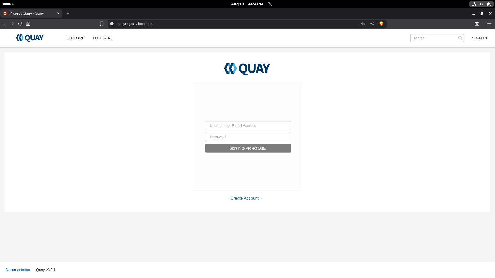
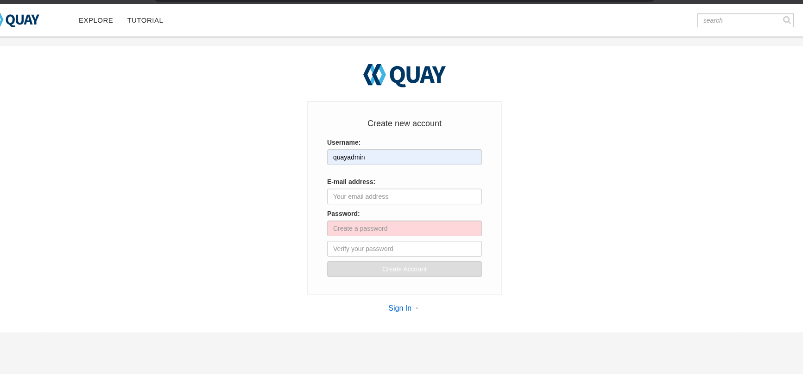
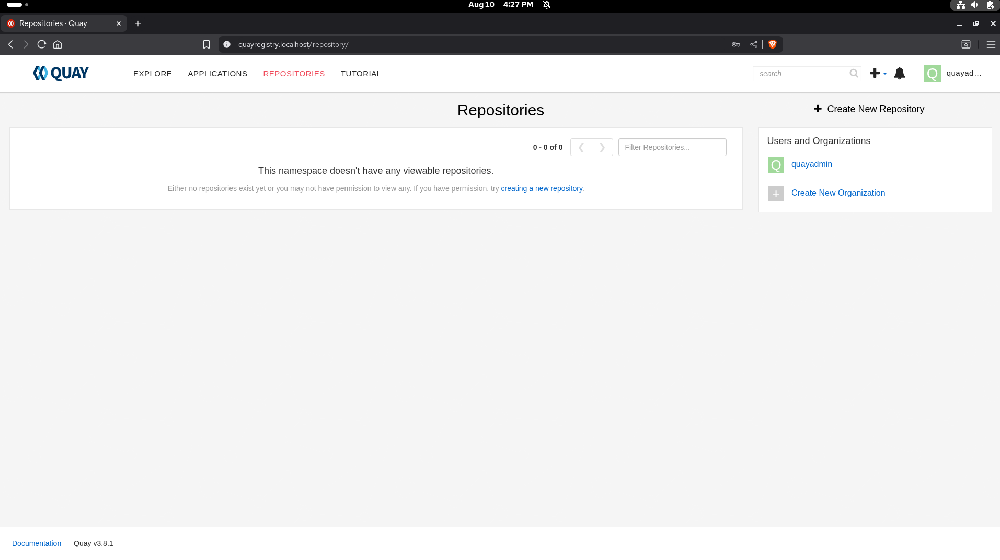
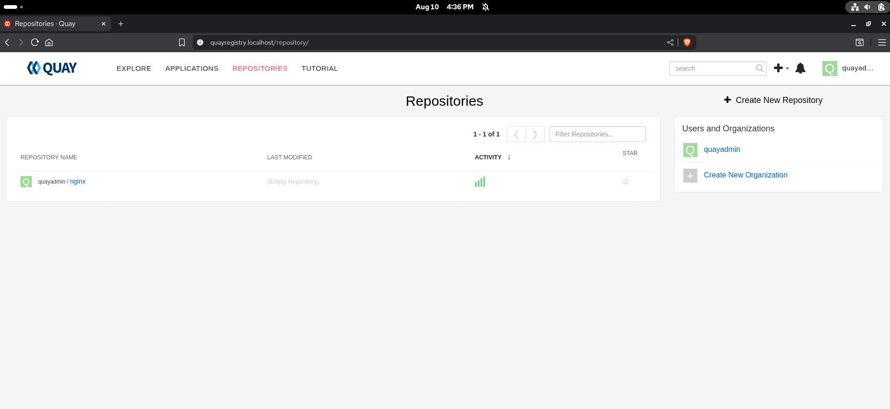
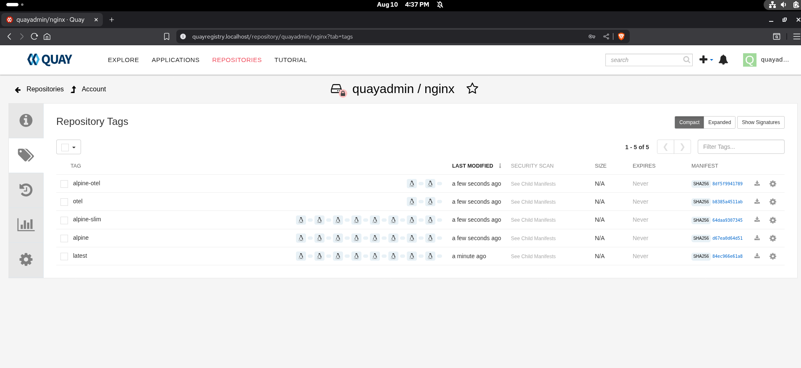
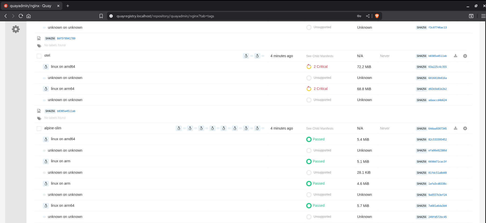
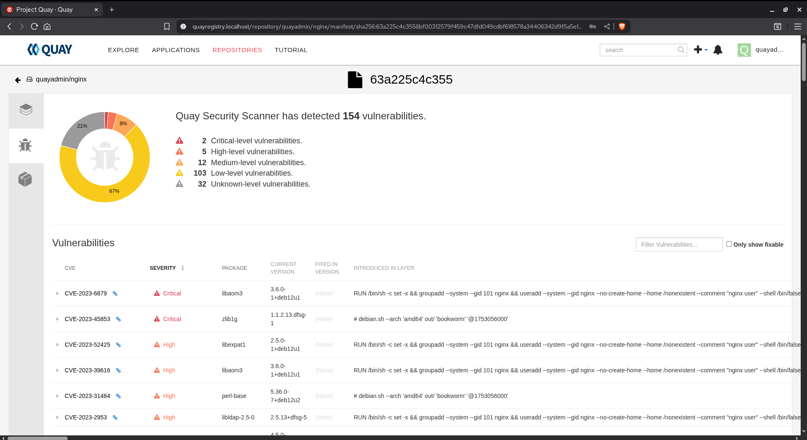
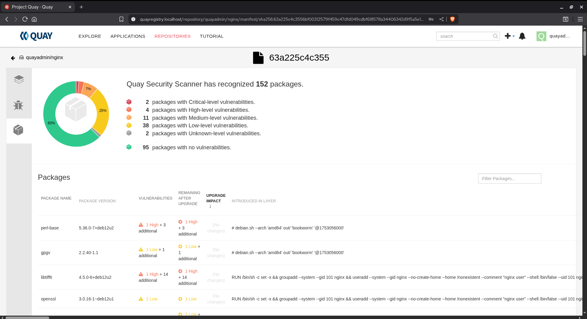

# Running Quay Locally on Laptop

You need Docker Desktop **or** Podman Desktop.

## 1) Bootstrap

```bash
chmod +x ./*.sh
chmod +x ./helm-instructions/*.sh
./startup.sh
```

This spins up Postgres + Redis for Quay/Clair and then launches both services. It’s resource-heavy; make sure your laptop has enough CPU/RAM.

Open **[http://quayregistry.localhost](http://quayregistry.localhost)**.



Create an account (recommended username: `quayadmin`; pick any password/email).



You’ll land in the Quay UI:



## 2) CLI login

```bash
./start-quay-login.sh
```

Enter your Quay username (`quayadmin`) and the password you set in the UI. You should see:

```
Login Succeeded!
✅ Logged into quayregistry.localhost as quayadmin
```

## 3) Push sample images

```bash
./start-push-images.sh
```

Now in the UI:

* **Repositories** — repos appear as images are pushed:



* Inside a repo → **Tags**:



* For a tag → **See child manifests** to view per-arch manifests and vulnerability results:



* Click the tag showing vulnerabilities for details:



* **Packages** (left nav) shows the SBOM:



Want more samples?

```bash
./start-push-dev-images.sh
./helm-instructions/helm-chart-to-quay.sh
```

## 4) Teardown

```bash
./start-teardown.sh
```

This stops/removes the containers and networks used for the demo.
It **does not** delete your pushed images unless you also remove the Quay data volume separately.
